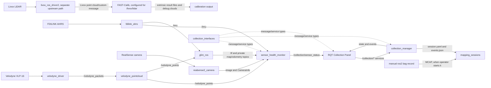

# Farm Sensor Collection Workspace

For the Livox MID-360 + DECXIN + GLIM one-command workflow, see
[docs/livox_glim_ui.md](docs/livox_glim_ui.md).

## 1. Overview

This ROS 2 Humble workspace integrates a Velodyne VLP-16, an FDILINK AHRS, an optional Intel RealSense camera, sensor-health reporting, an operator RQT panel, and GLIM LiDAR-inertial mapping. It also vendors separate Livox SDK/driver and FAST-Calib projects. The active project bringup uses Velodyne, not Livox.

The collection UI currently validates session metadata and timing only. `collection_manager` deliberately rejects non-UI-only preflight requests and never starts `rosbag2`; real bags must be recorded separately. Static inspection confirms interfaces and configuration, but not current hardware availability or calibration accuracy.

Repository links use container paths (`/workspace/farm_ws`); on the host this checkout is mounted at `/home/jimmy/farm_ws`.

## 2. System Architecture



No source-confirmed connection exists from the Livox driver to the custom collection launches, health monitor, or configured GLIM instance. FAST-Calib reads a bag and image from configured file paths; it does not subscribe live.

## 3. Workspace Layout

```text
farm_ws/
├── config/                     custom runtime sensor, TF, and GLIM configuration
├── docker/                     Ubuntu 22.04 / ROS 2 Humble development image
├── rviz/collection.rviz        custom sensor/collection view
├── scripts/                    build, inspection, UI, and privileged setup helpers
└── src/
    ├── collection_{bringup,interfaces,manager,rqt_panel}  custom collection system
    ├── farm_sensor_bringup      custom physical-sensor integration
    ├── sensor_health_monitor    custom health aggregation
    ├── FAST-Calib-ROS2          third-party LiDAR-camera calibration package
    ├── fdilink_ahrs             third-party ROS 2 IMU driver
    ├── serial                   third-party C++ serial library
    ├── Livox-SDK2              third-party, non-ROS Livox SDK
    ├── ws_livox/src/livox_ros_driver2  third-party nested ROS workspace/package
    ├── glim                    upstream GLIM core submodule
    └── glim_ros2               upstream ROS package `glim_ros` submodule
```

| Component | Status | Language/build | Verified responsibility |
|---|---|---|---|
| `collection_bringup` | Custom ROS package | Python launch, `ament_cmake` | Starts collection core/UI processes. |
| `collection_interfaces` | Custom ROS package | ROS IDL, `ament_cmake` | Collection messages and services. |
| `collection_manager` | Custom ROS package | Python, `ament_python` | UI-only session state machine and metadata writer. |
| `collection_rqt_panel` | Custom ROS package | Python/Qt, `ament_python` | Operator panel and service clients. |
| `preview_tools` | Custom ROS package | Python, `ament_python` | GLIM mapping trajectory and approximate visited-cell coverage preview for RViz, RQT, and Web adapters. |
| `farm_sensor_bringup` | Custom ROS package | Python launch, `ament_cmake` | Velodyne/FDILINK/RealSense/TF/GLIM integration. |
| `sensor_health_monitor` | Custom ROS package | Python, `ament_python` | Validates sensor messages, TF, and disk space. |
| `fast_calib` | Third-party ROS package | C++14+, `ament_cmake` | Offline target-based LiDAR-camera extrinsic calibration. |
| `fdilink_ahrs` | Third-party ROS package, locally adapted | C++14, `ament_cmake` | Serial AHRS decoding and IMU-related publishers. |
| `serial` | Third-party ROS package | C++, `ament_cmake` | Serial-port library used by FDILINK. |
| `Livox-SDK2` | Third-party project, not a ROS package | C/C++, CMake | Livox device communication SDK installed to `/usr/local`. |
| `livox_ros_driver2` | Third-party ROS package in nested workspace | C++14, `ament_cmake` | Livox ROS 2 driver and custom messages. |
| `glim` | Third-party submodule/ROS package | C++17, `ament_cmake` | GLIM mapping libraries and configuration. |
| `glim_ros` (`glim_ros2/`) | Third-party submodule/ROS package | C++17, `ament_cmake` | ROS adapter, online/offline processing, viewer/editor. |

Generated `build/`, `install/`, and `log/` trees—including those under `src/ws_livox`—are artifacts, not source components.

## 4. Package Reference

### `collection_interfaces`

- Purpose/build: custom ROS interface package; `ament_cmake` with `rosidl_default_generators`.
- Executables/launch/config: none.
- Interfaces: all are described in [Custom Interfaces](#5-custom-interfaces).
- Dependencies: `builtin_interfaces`, ROSIDL generator/runtime.
- Topics/services/parameters/TF/actions: defines types only; no runtime entities and no actions.

### `collection_manager`

- Purpose/build: UI-only session state machine and filesystem metadata; `ament_python`.
- Executable: `collection_manager` (`collection_manager.manager:main`). No package launch/config files.
- Publishes: `/collection/state` (`CollectionState`, depth 10), `/collection/events` (`CollectionEvent`, depth 10).
- Services: `/collection/preflight`, `/collection/start`, `/collection/stop`, `/collection/add_marker`.
- Parameter: `session_root`, default `/workspace/farm_ws/mapping_sessions`.
- Output: timestamped session directories with `raw/`, `config/`, `calibration/`, `reports/`, `markers/`, `session.yaml`, and `markers/events.json`. No MCAP is created.
- Subscriptions/actions/TF: none.
- Dependencies: `rclpy`, `collection_interfaces`, PyYAML.

### `sensor_health_monitor`

- Purpose/build: payload-aware topic and disk health; `ament_python`.
- Executable: `sensor_health_monitor`. No package launch/config files; [health.yaml](config/sensors/health.yaml) is passed by `collection_core.launch.py`.
- Subscribes with sensor-data QoS: configurable Velodyne packets (`velodyne_msgs/VelodyneScan`, if installed), point cloud, IMU, image, CameraInfo, and TF.
- Defaults: `/velodyne_packets`, `/velodyne_points`, `/imu`, `/camera/color/image_raw`, `/camera/color/camera_info`, `/tf`; `stale_after_sec=2.0`.
- Publishes: `/collection/sensor_status` (`SensorStatus`, depth 20), including a disk check for `/workspace/farm_ws`; warns below 10 GB free.
- Services/actions/TF: none. Dependencies: `rclpy`, `collection_interfaces`, `sensor_msgs`, `tf2_msgs`; runtime packet checking additionally needs `velodyne_msgs`.

### `collection_rqt_panel`

- Purpose/build: RQT plugin; `ament_python`, Qt `.ui` resource, and [plugin.xml](src/collection_rqt_panel/plugin.xml).
- Plugin type: `collection_rqt_panel.panel.CollectionPanel`; no console executable.
- Subscribes: `/collection/state`, `/collection/sensor_status`, `/collection/events`.
- Clients: the four `/collection/*` services listed above.
- Parameters/actions/TF/publications: none.
- Dependencies: `rclpy`, `ament_index_python`, `rqt_gui`, `rqt_gui_py`, `python_qt_binding`, `collection_interfaces`.
- “Open folder” runs `xdg-open` on the session path and therefore requires a desktop environment.

### `collection_bringup`

- Purpose/build: launch-only `ament_cmake` package.
- Launch files: `collection_core.launch.py` (manager + health), `collection_ui.launch.py` (RQT/RViz/image view), `collection_full.launch.py` (core + UI).
- `collection_core` uses absolute config/session paths. `collection_ui` uses `/workspace/farm_ws/rviz/collection.rviz`.
- `collection_full` arguments are `ui_only`, `start_rqt`, `start_rviz`, `start_image_view`, `start_glim`, and `start_drivers`. The last three integration flags do not start drivers or GLIM here; they only control UI or log messages. `ui_only` is declared but not forwarded to the manager.
- Runtime entities come from the launched packages; this package defines none.

### `farm_sensor_bringup`

- Purpose/build: launch/config integration for physical sensors; `ament_cmake`.
- Launch files: `velodyne.launch.py`, `fdilink.launch.py`, `realsense.launch.py`, `sensors.launch.py`, and primary integrated `sensors_with_ui.launch.py`.
- Config: [Velodyne](config/sensors/velodyne.yaml), [FDILINK](config/sensors/fdilink.yaml), [RealSense](config/sensors/realsense.yaml), [health](config/sensors/health.yaml), [frame assumptions](config/sensors/frames.yaml), VLP-16 calibration, and [GLIM profile](config/vlp16_fdilink/config_ros.json).
- Explicit data topics: `/velodyne_packets`, `/velodyne_points`, `/imu`, FDILINK auxiliary topics, RealSense topics, `/tf`, `/tf_static`, and GLIM topics described below.
- TF: optional `base_link -> velodyne` identity and `velodyne -> imu_link` mounting assumption; optional configured `velodyne -> camera_link`. Both sensor transforms are marked uncalibrated in `frames.yaml`. RealSense publishes its internal TF when enabled.
- `sensors.launch.py` arguments select drivers and transforms. Semantic projection is refused when requested without configured camera extrinsics.
- `sensors_with_ui.launch.py` adds collection core/UI and optionally `glim_rosnode`; `ui_only:=true` skips physical sensor launch. Its GLIM `config_path` and `dump_path` are absolute.
- Dependencies: Velodyne, FDILINK, RealSense, `glim_ros`, `tf2_ros`, collection bringup, launch libraries.

No actions are defined by any custom package. Where a package section does not name a service, parameter, topic, or TF frame, none was confirmed from its source.

## 5. Custom Interfaces

All files are under [`src/collection_interfaces`](src/collection_interfaces/).

| Interface | Fields and meaning | Confirmed producer → consumer |
|---|---|---|
| `SensorStatus.msg` | Status constants `UNKNOWN..ERROR`; `name`, monitored `topic`, `status`, measured `measured_rate_hz`, `last_message_age_sec`, `detail`. Rates are Hz and age is seconds by field name. | health monitor → RQT panel |
| `CollectionState.msg` | State constants `IDLE..FAILED`; `state`, elapsed/remaining seconds, `bag_size_bytes`, free disk GB, session path, detail. | manager → RQT panel |
| `CollectionEvent.msg` | ROS `Time stamp`, textual `level`, `message`, optional `marker`. | manager → RQT panel |
| `PreflightCollection.srv` | Request: session name, location, duration seconds, profile, note, UI-only flag. Response: success, message, session path. | RQT panel/test script → manager |
| `StartCollection.srv` | Empty request; success and message response. | RQT panel/test script → manager |
| `StopCollection.srv` | Empty request; success and message response. | RQT panel → manager |
| `AddMarker.srv` | Marker label request; success and message response. | RQT panel → manager |

The state manager sets duration to at least 0.1 seconds, applies a fixed three-second countdown, and writes marker/event metadata. It currently leaves `bag_size_bytes` at its message default.

## 6. Data and Control Flow

- Sensor data: VLP-16 UDP 2368 → `velodyne_driver_node` → `/velodyne_packets` → `velodyne_transform_node` → `/velodyne_points`. FDILINK serial → `/imu` plus `/mag_pose_2d`, `/magnetic`, `/euler_angles`, `/gps/fix`, `/system_speed`, `/NED_odometry`. RealSense advertises `/camera/color/image_raw` and `/camera/color/camera_info` when launched.
- Monitoring: the monitor validates message payload and staleness, requires a TF involving `map` before declaring “GLIM TF” healthy, checks disk, and publishes `/collection/sensor_status`.
- Collection control: RQT calls preflight/start/stop/marker services; the manager publishes state/events and writes metadata. Real recording is not connected.
- Calibration: FAST-Calib loads `bag_path` and `image_path` at startup, reads configured `lidar_topic` from the bag, estimates `T_cam_lidar`, writes results to `output_path`, and publishes debug clouds in frame `map` while running. Defaults are placeholders and must be replaced.
- SLAM: configured `glim_ros` subscribes `/velodyne_points`, `/imu`, and optionally `/camera/color/image_raw`; its RViz extension publishes private `~/map`, `~/points*`, `~/aligned_points*`, `~/odom*`, and `~/pose*` topics and broadcasts configured `map`, `odom`, `base_link`, and sensor transforms.
- GUI: `collection_ui.launch.py` starts the standalone collection plugin and optional RViz/image view. GUI availability and rendering require X11/Qt.
- Mapping preview: `preview_tools/coverage_analyzer` converts `/glim_ros/odom`
  into `/collection/trajectory`, `/coverage/markers`, diagnostics, and
  `/coverage/status_json`. The JSON explicitly reports mapping mode and
  `pure_localization=false`; see
  [Mapping coverage preview](docs/mapping_coverage_ui.md).

## 7. Requirements

- Ubuntu 22.04 and ROS 2 Humble are fixed by [Dockerfile](docker/Dockerfile); the host may differ when Docker is used.
- Build tools: GCC/Clang with C++14 for drivers/calibration and C++17 for GLIM, CMake (GLIM ROS requests 3.16), colcon, rosdep, Python 3, setuptools, PyYAML, pytest, PyQt5.
- ROS: desktop, CycloneDDS RMW, RQT/RQT image view, RViz and IMU plugin, rosbag2 MCAP, Velodyne, RealSense, TF, image transport.
- Native libraries: PCL, OpenCV, Eigen, APR, Boost, OpenMP, Metis, fmt, spdlog, GLFW, GLM, GTSAM/gtsam_points, Iridescence. GLIM viewer/GPU options can be disabled; the Docker build installs CUDA 12.6 libraries and enables CUDA by default.
- Livox: build/install [Livox-SDK2](src/Livox-SDK2/) before `livox_ros_driver2`, which looks for SDK headers and `/usr/local/lib/liblivox_lidar_sdk_shared.so`.
- Devices: VLP-16 Ethernet/UDP, FDILINK serial device (configured `/dev/ttyUSB0`, 921600 baud), and optional RealSense USB device. Serial access requires suitable `dialout`/udev permissions. Host network must receive the LiDAR’s UDP stream.
- Docker defines `ROS_DOMAIN_ID=40` and `RMW_IMPLEMENTATION=rmw_cyclonedds_cpp`; host processes must match to communicate.

Exact third-party pins recorded by the repository are in [VERSIONS.txt](VERSIONS.txt).

## 8. Build Instructions

Inside the project container:

```bash
cd /workspace/farm_ws
source /opt/ros/humble/setup.bash
rosdep install --from-paths src --ignore-src -r -y
colcon build --symlink-install --event-handlers console_direct+
source install/setup.bash
```

`rosdep` is appropriate for ROS package metadata, but locally vendored/custom dependency keys may still require the Docker/native dependencies above. The repository helper uses the same command without blanket skip keys: `./scripts/install_deps.sh`.

Livox has a separate native prerequisite and a nested workspace layout. Do not reuse `src/ws_livox/build`, `install`, or `log`:

```bash
cd /workspace/farm_ws/src/Livox-SDK2
mkdir -p build && cd build
cmake .. && cmake --build .
sudo cmake --install .
cd /workspace/farm_ws
source /opt/ros/humble/setup.bash
colcon build --symlink-install --packages-select livox_ros_driver2 \
  --cmake-args -DROS_EDITION=ROS2
```

The SDK install changes `/usr/local` and should only be run deliberately. For the main stack, `./scripts/build_all.sh`, `build_glim.sh`, and `build_ui.sh` encode repository build selections. GLIM must build before `glim_ros`, while `collection_interfaces` must build before its Python consumers; colcon resolves this from manifests.

## 9. Runtime Configuration

- Middleware: Docker uses domain 40 and CycloneDDS. No CycloneDDS XML/interface pin is committed.
- Velodyne: `device_ip=192.168.1.201`, host helper default `192.168.1.10/24`, UDP 2368, VLP16 at 600 RPM, frame `velodyne`, 0.3–30 m filter. Override helper variables `VELODYNE_INTERFACE`, `VELODYNE_HOST_IP`, `VELODYNE_SENSOR_IP`, and `VELODYNE_UDP_PORT` on the host.
- FDILINK: `/dev/ttyUSB0`, 921600 baud, five open retries at 1000 ms, frame `imu_link`, topic `/imu`.
- RealSense: color only, `1280x720x15` RGB8, frame base `camera_link`; depth/motion/point cloud are disabled. Repository comments say the observed USB 2.1 link motivated 15 FPS; current hardware must be revalidated.
- TF: [frames.yaml](config/sensors/frames.yaml) explicitly marks LiDAR/IMU/camera extrinsics uncalibrated. Do not treat defaults as calibration results.
- GLIM: CPU module selection is active in `config.json`; topics and frames are in `config_ros.json`; IMU noise and `T_lidar_imu` are in `config_sensors.json`. `T_lidar_imu` is still an assumed mount.
- Collection: session root defaults to `/workspace/farm_ws/mapping_sessions`; UI preflight supplies name, location, duration, profile, note, and UI-only mode.
- Livox: driver launch files consume JSON under `src/ws_livox/src/livox_ros_driver2/config/`; edit host/LiDAR IPs for the actual device. These values are separate from Velodyne configuration.
- Calibration: replace every `/modify/path/...` in `qr_params.yaml`, choose the recorded LiDAR topic, and verify camera intrinsics/target dimensions before running.

## 10. Running the System

After sourcing both ROS and the workspace:

```bash
source /opt/ros/humble/setup.bash
cd /workspace/farm_ws
source install/setup.bash
```

Verified launch entry points:

```bash
# Individual/sensor-only bringup (launches real hardware)
ros2 launch farm_sensor_bringup velodyne.launch.py
ros2 launch farm_sensor_bringup fdilink.launch.py
ros2 launch farm_sensor_bringup realsense.launch.py
ros2 launch farm_sensor_bringup sensors.launch.py start_realsense:=false

# Collection manager + health monitor, no hardware launch
ros2 launch collection_bringup collection_core.launch.py

# RQT/RViz operator UI
ros2 launch collection_bringup collection_ui.launch.py start_image_view:=false

# UI-only full collection stack
ros2 launch collection_bringup collection_full.launch.py start_drivers:=false start_glim:=false

# Integrated physical sensors, collection UI, and optional GLIM
ros2 launch farm_sensor_bringup sensors_with_ui.launch.py start_glim:=true start_realsense:=false

# Offline file-based calibration (after fixing qr_params.yaml)
ros2 launch fast_calib calib.launch.py rviz:=true
```

There is no upstream GLIM launch file in this checkout; use `sensors_with_ui.launch.py` or run `ros2 run glim_ros glim_rosnode --ros-args -p config_path:=/workspace/farm_ws/config/vlp16_fdilink`. Livox launches are under the upstream nonstandard `launch_ROS2` directory; for example `ros2 launch livox_ros_driver2 msg_MID360_launch.py`, after SDK installation and IP configuration. There is no one launch file that starts both the active custom stack and Livox.

## 11. Verification

These commands are read-only except that nodes may already be running:

```bash
ros2 pkg list | grep -E 'collection_|farm_sensor|sensor_health|fdilink|glim|livox'
ros2 pkg executables collection_manager
ros2 pkg executables glim_ros
ros2 node list
ros2 topic list
ros2 service list
ros2 action list
ros2 topic hz /velodyne_points
ros2 topic hz /imu
ros2 topic echo /collection/sensor_status --once
ros2 topic echo /collection/state --once
ros2 service type /collection/preflight
ros2 doctor --report
```

Expect the custom packages, `collection_manager`/`sensor_health_monitor`, and GLIM executables after a successful build/source. With sensors running, point-cloud and IMU rates should be nonzero; the repository does not define a universal acceptable rate beyond the configured health staleness threshold. `/collection/sensor_status` should report `OK`, `WAITING`, `WARNING`, or `ERROR` based on actual payloads. `ros2 action list` is expected to show no actions from these custom packages.

For manual UI-only state validation, [test_ui_only.sh](scripts/test_ui_only.sh) checks service availability, completion metadata, and absence of fake MCAP. It runs nodes for about 14 seconds and should be invoked deliberately.

## 12. Typical Collection Workflow

1. Connect Ethernet LiDAR, FDILINK serial, and optional camera. This is recommended practice; presence is not guaranteed by source.
2. On the host, inspect with `./scripts/check_velodyne_network.sh` and `./scripts/check_sensor_devices.sh`. Run privileged setup scripts only after reviewing their targets.
3. Source/build, then launch individual sensors or `sensors.launch.py`.
4. Start `collection_core.launch.py`; inspect `/collection/sensor_status`, rates, TF, disk, and `ros2 doctor`.
5. For the confirmed UI-only workflow, preflight and start from RQT; the manager performs a three-second countdown and timer only.
6. Monitor state/events in RQT and actual sensor topics separately.
7. Stop through `/collection/stop`, or wait for duration completion.
8. Inspect `session.yaml` and `markers/events.json`. For real data, separately start/stop `ros2 bag record --storage mcap ...` and verify with `ros2 bag info`; this is recommended because the manager does not record.
9. Optionally run FAST-Calib only after recording appropriate Livox point data and a corresponding image and correcting its placeholder parameters.
10. Optionally run GLIM with the VLP16/FDILINK configuration and inspect TF/map outputs. Calibration quality and mapping accuracy require hardware validation.

## 13. Troubleshooting

- Package not found/workspace not sourced: source `/opt/ros/humble/setup.bash`, rebuild, then source `install/setup.bash`; confirm names with `colcon list`.
- Nested artifacts: ignore/remove only targeted `src/ws_livox/{build,install,log}` artifacts before a clean top-level rebuild; never document them as packages.
- Livox unavailable: install Livox-SDK2, verify JSON host/LiDAR IPs and host interface, then inspect driver logs. Do not reuse Velodyne IP assumptions.
- Velodyne unavailable/network mismatch: run the read-only network check; verify interface, `192.168.1.201`, host subnet, UDP 2368, and firewall. The setup script changes host networking and requires explicit root use.
- CycloneDDS mismatch: ensure all processes share `ROS_DOMAIN_ID=40` and `RMW_IMPLEMENTATION=rmw_cyclonedds_cpp`; if a custom CycloneDDS XML is introduced, verify its NIC exists.
- Serial permission denied: inspect `/dev/ttyUSB0`, group membership, and the reviewed udev rule. Do not chmod devices indiscriminately.
- Missing IMU/cloud: inspect driver nodes and `ros2 topic info -v`; compare configured topic names. Sensor-data/best-effort QoS may require a matching subscriber (`ros2 topic echo --qos-reliability best_effort ...`).
- Missing TF: inspect `/tf` and `/tf_static` and use `tf2_echo`; camera extrinsics are intentionally absent until configured, and GLIM health requires a `map` transform.
- GLIM has no input: verify `/velodyne_points` and `/imu`, finite values, timestamps, frames, sensor-data QoS, and `config_ros.json`. GPU library/driver mismatch may require rebuilding with `BUILD_WITH_CUDA=OFF` for diagnosis.
- RQT plugin absent: rebuild/source, run `rqt --force-discover`, and verify `plugin.xml` plus the installed RQT resource index.
- Interfaces not generated: build `collection_interfaces` first or `--packages-up-to collection_manager`, then re-source.
- Collection service unavailable: launch `collection_core.launch.py` and check `/collection/preflight`. Non-UI-only requests are intentionally rejected.
- Output permission/path errors: ensure `/workspace/farm_ws/mapping_sessions` exists and is writable; both manager and health monitor contain this absolute container path.
- Calibration failure: placeholder paths, mismatched image/point data, incorrect intrinsics/target dimensions, or absent `lidar_topic` in the bag are the first checks.

## 14. Development Notes

- Add custom Python nodes to their package module plus `setup.py` console scripts; add C++ targets to the owning `CMakeLists.txt` and install rules.
- Put shared ROS messages/services in `collection_interfaces/msg` or `srv`, launch files in a package `launch/`, and reusable configuration in the owning package or top-level `config/` when it is deployment-specific.
- Never edit generated `build/`, `install/`, `log/`, caches, recorded sessions, calibration output, or generated frame diagrams.
- Treat GLIM, Livox, FAST-Calib, FDILINK, and serial as upstream code; prefer adapters/configuration unless an explicit task requires an upstream patch.
- Preserve topic, service, action, parameter, frame, package, and interface compatibility.
- Available package tests are principally `ament_lint_auto` in CMake packages and `pytest` declarations in Python packages. Useful commands are `colcon test --packages-select <package>` and `colcon test-result --verbose`. `scripts/test_ui_only.sh` is an integration test with a bounded runtime and filesystem output.

## 15. Known Limitations

- Collection management is UI-only; it refuses real recording and reports zero bag size.
- `collection_full.launch.py` does not actually start hardware or GLIM despite exposing `start_drivers`/`start_glim`; the integrated physical entry point is in `farm_sensor_bringup`.
- Several custom launch/config paths are hard-coded to `/workspace/farm_ws`, so direct host execution at `/home/jimmy/farm_ws` needs path overrides or the container mount.
- Camera and LiDAR/IMU extrinsics are explicitly uncalibrated; camera TF is disabled by default.
- FAST-Calib ships placeholder input/output paths and Livox-oriented defaults; it is not wired to the active Velodyne stack.
- The Livox driver is nested under a second workspace that contains stale/generated artifact directories.
- FDILINK metadata contains TODO description/license fields; consult its upstream repository before redistribution.
- Repository logs describe prior device tests, but current device presence, rates, USB transport, GPU support, and calibration remain runtime facts.

## 16. License and Third-Party Components

There is no confirmed workspace-wide license. Custom collection packages and bringup declare Apache-2.0 individually. `glim`, `glim_ros`, and `livox_ros_driver2` declare MIT; FAST-Calib declares GPLv2. Livox-SDK2, serial, FDILINK, and bundled libraries have their own license files or upstream terms; consult each component before distribution. Do not rely on the FDILINK package’s `TODO` license declaration.

## Documentation status

Verified statically: all discovered `package.xml`, `CMakeLists.txt`, Python packaging/entry points, custom interfaces, plugin metadata, launch files, primary custom node implementations, relevant upstream driver/calibration/GLIM declarations, top-level configuration, Docker/scripts, submodule metadata, and existing documentation. Launch commands and package/executable names were checked against installed rules and source files; relative links were written against the repository layout.

Still requires real hardware/runtime validation: device discovery, interface/IP routing, serial access, current topic rates and QoS compatibility, camera streaming, TF correctness, extrinsic/intrinsic accuracy, real MCAP contents, Livox connectivity, GLIM map quality, GUI rendering, GPU/CUDA operation, and output permissions in the deployment environment.
